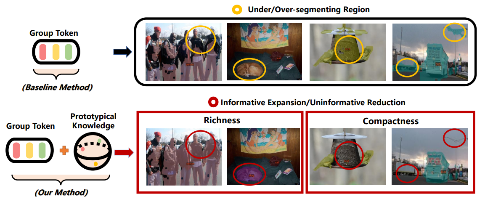
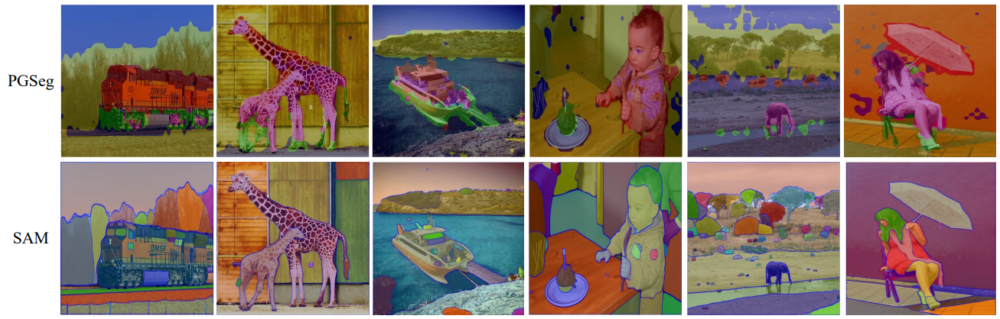

# PGSeg: Uncovering Prototypical Knowledge for Weakly Open-Vocabulary Semantic Segmentation

PGSeg is a framework for learning semantic segmentation with only image-text pairs. It introduces the *prototyical knowledge* to provide explicit supervision for the group tokens, which are used to perform bottom-up heirarchical spatial grouping of 
semantically-related visual regions. This repository is the official implementation of PGSeg 
introduced in the paper:

[**Uncovering Prototypical Knowledge for Weakly
Open-Vocabulary Semantic Segmentation, NeurIPS 2023**](https://arxiv.org/abs/2310.19001),
[*Fei Zhang*](https://scholar.google.com/citations?user=Omrg6UkAAAAJ&hl=zh-CN), et.al. 

<div align="center">


</div>

***

## Visual Results 
* Comparison with SAM
<div align="center">


</div>


***

## Environmental Setup

[//]: # (>Since the installation of this environment is quite annoying, I provide a conda-packed environment in [here]&#40;&#41;, in case of  some weired bugs due to the **unfit** environment. )
 
* Python 3.7
* PyTorch 1.8
* webdataset 0.1.103
* mmsegmentation 0.18.0
* timm 0.4.12

Instructions:

```shell
conda create -n groupvit python=3.7 -y
conda activate groupvit
conda install pytorch==1.8.0 torchvision==0.9.0 cudatoolkit=11.1 -c pytorch -c conda-forge
pip install mmcv-full==1.3.14 -f https://download.openmmlab.com/mmcv/dist/cu111/torch1.8.0/index.html
pip install mmsegmentation==0.18.0
pip install webdataset==0.1.103
pip install timm==0.4.12
git clone https://github.com/NVIDIA/apex
cd && apex && pip install -v --disable-pip-version-check --no-cache-dir --global-option="--cpp_ext" --global-option="--cuda_ext" ./
pip install opencv-python==4.4.0.46 termcolor==1.1.0 diffdist einops omegaconf
pip install nltk ftfy regex tqdm
```

 
***

## Benchmark Results

<table>
<thead>
  <tr>
    <th></th>
    <th colspan="3">Zero-shot Segmentation</th>
  </tr>
</thead>
<tbody>
  <tr>
    <td>config</td>
    <td>Pascal VOC</td>
    <td>Pascal Context</td>
    <td>COCO</td>
    <td>Checkpoints</td>
  </tr>
  <tr>
    <td>GCC</td>
    <td>49.0</td>
    <td>20.6</td>
    <td>22.9</td>
    <td> - </td>
  </tr>
  <tr>
    <td>GCC + RedCaps </td>
    <td>53.2</td>
    <td>23.8</td>
    <td>28.7</td>
    <td> <a href="https://drive.google.com/file/d/1BxryBZ9hJbRpUAkjMJT865N5uRptfdjb/view?usp=sharing">pre-trained weights</a> </td>

  </tr>
</tbody>
</table>


***

## Data Preparation

During training, we use [webdataset](https://webdataset.github.io/webdataset/) for scalable data loading.
To convert image text pairs into the webdataset format, we use the [img2dataset](https://github.com/rom1504/img2dataset) tool to download and preprocess the dataset.

For inference, we use [mmsegmentation](https://github.com/open-mmlab/mmsegmentation) for semantic segmentation testing, evaluation and visualization on Pascal VOC, Pascal Context and COCO datasets.

The overall file structure is as follows:

```shell
GroupViT
├── local_data
│   ├── gcc3m_shards
│   │   ├── gcc-train-000000.tar
│   │   ├── ...
│   │   ├── gcc-train-000436.tar
│   ├── gcc12m_shards
│   │   ├── gcc-conceptual-12m-000000.tar
│   │   ├── ...
│   │   ├── gcc-conceptual-12m-001943.tar
│   ├── yfcc14m_shards
│   │   ├── yfcc14m-000000.tar
│   │   ├── ...
│   │   ├── yfcc14m-001888.tar
│   ├── redcap12m_shards
│   │   ├── redcap12m-000000.tar
│   │   ├── ...
│   │   ├── redcap12m-001211.tar
│   ├── imagenet_shards
│   │   ├── imagenet-val-000000.tar
│   │   ├── ...
│   │   ├── imagenet-val-000049.tar
│   ├── VOCdevkit
│   │   ├── VOC2012
│   │   │   ├── JPEGImages
│   │   │   ├── SegmentationClass
│   │   │   ├── ImageSets
│   │   │   │   ├── Segmentation
│   │   ├── VOC2010
│   │   │   ├── JPEGImages
│   │   │   ├── SegmentationClassContext
│   │   │   ├── ImageSets
│   │   │   │   ├── SegmentationContext
│   │   │   │   │   ├── train.txt
│   │   │   │   │   ├── val.txt
│   │   │   ├── trainval_merged.json
│   │   ├── VOCaug
│   │   │   ├── dataset
│   │   │   │   ├── cls
│   ├── coco
│   │   ├── images
│   │   │   ├── train2017
│   │   │   ├── val2017
│   │   ├── annotations
│   │   │   ├── train2017
│   │   │   ├── val2017
```

The instructions for preparing each dataset are as follows.

### GCC3M

Please download the training split annotation file from [Conceptual Caption 12M](https://ai.google.com/research/ConceptualCaptions/download) and name it as `gcc3m.tsv`.

Then run `img2dataset` to download the image text pairs and save them in the webdataset format.
```
sed -i '1s/^/caption\turl\n/' gcc3m.tsv
img2dataset --url_list gcc3m.tsv --input_format "tsv" \
            --url_col "url" --caption_col "caption" --output_format webdataset\
            --output_folder local_data/gcc3m_shards
            --processes_count 16 --thread_count 64
            --image_size 512 --resize_mode keep_ratio --resize_only_if_bigger True \
            --enable_wandb True --save_metadata False --oom_shard_count 6
rename -d 's/^/gcc-train-/' local_data/gcc3m_shards/*
```
Please refer to [img2dataset CC3M tutorial](https://github.com/rom1504/img2dataset/blob/main/dataset_examples/cc3m.md) for more details.

### GCC12M

Please download the annotation file from [Conceptual Caption 12M](https://github.com/google-research-datasets/conceptual-12m) and name it as `gcc12m.tsv`.

Then run `img2dataset` to download the image text pairs and save them in the webdataset format.
```
sed -i '1s/^/caption\turl\n/' gcc12m.tsv
img2dataset --url_list gcc12m.tsv --input_format "tsv" \
            --url_col "url" --caption_col "caption" --output_format webdataset\
            --output_folder local_data/gcc12m_shards \
            --processes_count 16 --thread_count 64
            --image_size 512 --resize_mode keep_ratio --resize_only_if_bigger True \
            --enable_wandb True --save_metadata False --oom_shard_count 6
rename -d 's/^/gcc-conceptual-12m-/' local_data/gcc12m_shards/*
```
Please refer to [img2dataset CC12M tutorial](https://github.com/rom1504/img2dataset/blob/main/dataset_examples/cc12m.md) for more details.

### YFCC14M
Please follow the [CLIP Data Preparation](https://github.com/openai/CLIP/blob/main/data/yfcc100m.md) instructions to download the YFCC14M subset.
```
wget https://openaipublic.azureedge.net/clip/data/yfcc100m_subset_data.tsv.bz2
bunzip2 yfcc100m_subset_data.tsv.bz2
```

Then run the preprocessing script to create the subset sql db and annotation tsv files. This may take a while.
```
python convert_dataset/create_subset.py --input-dir . --output-dir . --subset yfcc100m_subset_data.tsv
```
This script will create two files: an SQLite db called `yfcc100m_dataset.sql` and an annotation tsv file called `yfcc14m_dataset.tsv`.

Then follow the [YFCC100M Download Instruction](https://gitlab.com/jfolz/yfcc100m/-/tree/master) to download the dataset and its metadata file.
```
pip install git+https://gitlab.com/jfolz/yfcc100m.git
mkdir -p yfcc100m_meta
python -m yfcc100m.convert_metadata . -o yfcc100m_meta --skip_verification
mkdir -p yfcc100m_zip
python -m yfcc100m.download yfcc100m_meta -o yfcc100m_zip
```

Finally convert the dataset into the webdataset format.
```
python convert_dataset/convert_yfcc14m.py --root yfcc100m_zip --info yfcc14m_dataset.tsv --shards yfcc14m_shards
```

### RedCaps12M

Please download the annotation file from [RedCaps](https://redcaps.xyz/).
```
wget https://www.dropbox.com/s/cqtdpsl4hewlli1/redcaps_v1.0_annotations.zip?dl=1
unzip redcaps_v1.0_annotations.zip
```

Then run the preprocessing script and `img2dataset` to download the image text pairs and save them in the webdataset format.
```
python convert_dataset/process_redcaps.py annotations redcaps12m_meta/redcaps12m.parquet --num-split 16
img2dataset --url_list ~/data/redcaps12m/ --input_format "parquet" \
            --url_col "URL" --caption_col "TEXT" --output_format webdataset \
            --output_folder local_data/recaps12m_shards
            --processes_count 16 --thread_count 64
            --image_size 512 --resize_mode keep_ratio --resize_only_if_bigger True \
            --enable_wandb True --save_metadata False --oom_shard_count 6
rename -d 's/^/redcap12m-/' local_data/recaps12m_shards/*
```

### ImageNet

Please follow the [webdataset ImageNet Example](https://github.com/tmbdev-archive/webdataset-examples/blob/master/makeshards.py) to convert ImageNet into the webdataset format.

### Pascal VOC

Please follow the [MMSegmentation Pascal VOC Preparation](https://github.com/open-mmlab/mmsegmentation/blob/master/docs/en/dataset_prepare.md#pascal-voc) instructions to download and setup the Pascal VOC dataset.

### Pascal Context

Please refer to the [MMSegmentation Pascal Context Preparation](https://github.com/open-mmlab/mmsegmentation/blob/master/docs/en/dataset_prepare.md#pascal-context) instructions to download and setup the Pascal Context dataset.

### COCO

[COCO dataset](https://cocodataset.org/) is an object detection dataset with instance segmentation annotations.
To evaluate GroupViT, we combine all the instance masks of a catergory together and generate semantic segmentation maps.
To generate the semantic segmentation maps, please follow [MMSegmentation's documentation](https://github.com/open-mmlab/mmsegmentation/blob/master/docs/en/dataset_prepare.md#coco-stuff-164k) to download the COCO-Stuff-164k dataset first and then run the following

```shell
python convert_dataset/convert_coco.py local_data/data/coco/ -o local_data/data/coco/
```


### ImageNet-S
ImageNet-S, extracted from ImageNet, and labelled by human efforts with dense masks. It has three versions depending on the 
different volumes of training datasets. Please refer to [ImageNetS](https://github.com/LUSSeg/ImageNet-S) for further detail.

> Besides, since the inference to this dataset is quite **memory-burden**. Without some explicit operation to the scripts in package 'mmseg'
(mainly some tricks to control the cuda memory), the cuda would trigger out-of-memory. IF you would like to try on it, please contact me [here](ferenas@sjtu.edu.cn)


!!! Remember to set the right dataset path in 
```shell
"segmentation/configs/_base_/datasets"
```


## Run Experiments

### Pre-train 

>We used 4 NVIDIA A100 GPUs (80GB) for pre-training in our paper.

>Since the first 30 epoch training of PGSeg follows the same step with GroupViT, so a tuning on the [pretrained weight](https://github.com/xvjiarui/GroupViT-1/releases/download/v1.0.0/group_vit_gcc_redcap_30e-3dd09a76.pth) in GroupViT also works for this 
> PGSeg, which you may find quick convergency could be reached.

```shell
/path/to/config = configs/pgseg_specific.yml
```

Train on a single node:

```shell
(node0)$ ./tools/dist_launch.sh main_pg_seg.py /path/to/config $GPUS_PER_NODE
```

Train on multiple nodes:

```shell
(node0)$ ./tools/dist_mn_launch.sh main_pg_seg.py /path/to/config $NODE_RANK $NUM_NODES $GPUS_PER_NODE $MASTER_ADDR
(node1)$ ./tools/dist_mn_launch.sh main_pg_seg.py /path/to/config $NODE_RANK $NUM_NODES $GPUS_PER_NODE $MASTER_ADDR
```


### Zero-shot Transfer to Image Classification

#### ImageNet

```shell
./tools/dist_launch.sh main_pg_seg.py /path/to/config $NUM_GPUS --resume /path/to/checkpoint --eval
```

### Zero-shot Transfer to Semantic Segmentation

#### Pascal VOC

```shell
./tools/dist_launch.sh main_seg.py /path/to/config $NUM_GPUS --resume /path/to/checkpoint
```

#### Pascal Context

```shell
./tools/dist_launch.sh main_seg.py /path/to/config $NUM_GPUS --resume /path/to/checkpoint --opts evaluate.seg.cfg segmentation/configs/_base_/datasets/pascal_context.py
```

#### COCO

```shell
./tools/dist_launch.sh main_seg.py /path/to/config $NUM_GPUS --resume /path/to/checkpoint --opts evaluate.seg.cfg segmentation/configs/_base_/datasets/coco.py
```


***

## Citation & Acknowledgement

If you find our work useful in your research, please cite:

```latex
@article{zhang2023uncovering,
  title={Uncovering Prototypical Knowledge for Weakly Open-Vocabulary Semantic Segmentation},
  author={Zhang, Fei and Zhou, Tianfei and Li, Boyang and He, Hao and Ma, Chaofan and Zhang, Tianjiao and Yao, Jiangchao and Zhang, Ya and Wang, Yanfeng},
  journal={arXiv preprint arXiv:2310.19001},
  year={2023}
}
```
Great thanks to the code of [GroupVIT](https://github.com/xvjiarui/GroupViT/tree/main)!!!
